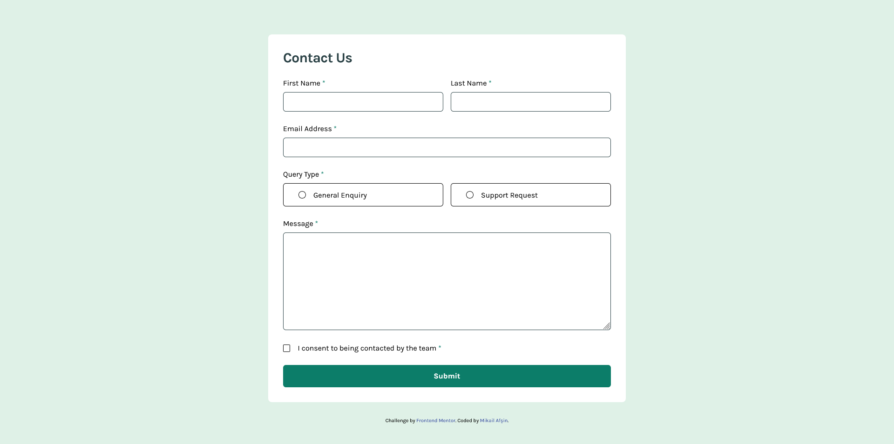

# Frontend Mentor - Contact form solution

This is a solution to the [Contact form challenge on Frontend Mentor](https://www.frontendmentor.io/challenges/contact-form--G-hYlqKJj).

## Table of contents

-   [Overview](#overview)
    -   [The challenge](#the-challenge)
    -   [Screenshot](#screenshot)
    -   [Links](#links)
-   [My process](#my-process)
    -   [Built with](#built-with)
    -   [What I learned](#what-i-learned)
    -   [Continued development](#continued-development)
-   [Author](#author)

## Overview

### The challenge

Users should be able to:

-   Complete the form and see a success toast message upon successful submission
-   Receive form validation messages if:
    -   A required field has been missed
    -   The email address is not formatted correctly
-   View the optimal layout for the interface depending on their device's screen size
-   See hover and focus states for all interactive elements on the page

### Screenshot

**Mobile**


**Desktop**


### Links

-   Solution URL: [GitHub]()
-   Live Site URL: [Vercel]()

## My process

### Built with

-   [React](https://reactjs.org/) - JS library
-   [TailwindCSS](https://tailwindcss.com/) - Css framework
-   [Formik](https://formik.org/) - React form library
-   [Toastify](https://fkhadra.github.io/react-toastify/introduction) - React notifications package
-   [Yup](https://github.com/jquense/yup) - Form validation
-   Mobile-first workflow

### What I learned

In this project, I learnt to implement form operations on React application with formik library. At the same time, I learnt to implement the validation operations required on the form with Yup.js. I learnt to show notification to the user with react-toastify during successful submission of the form.

**Yup.js Validation**

```jsx
const validations = object({
    firstName: string().required("This field is required"),
    lastName: string().required("This field is required"),
    email: string().email("Please enter a valid email address").required("This field is required"),
    queryType: string().required("Please select a query type"),
    message: string().required("This field is required"),
    requiredField: bool().oneOf([true], "To submit this form, please consent to being contacted"),
});
```

**useFormik() Hook and Toast Message**

```jsx
const { handleSubmit, handleChange, handleBlur, values, errors, touched } = useFormik({
    initialValues: {
        firstName: "",
        lastName: "",
        email: "",
        queryType: "",
        message: "",
        requiredField: false,
    },
    onSubmit: () => {
        toast.success(
            <div className="md:p-2">
                <div className="mb-3 flex items-start gap-2">
                    
                    <h1>Message Sent!</h1>
                </div>
                <p className="text-grey-500">
                    Thanks for completing the form. We'll be in touch soon!
                </p>
            </div>,
            {
                className: "bg-grey-900 text-white",
                icon: false,
            }
        );
    },
    validationSchema,
});
```

### Continued development

This contact form was a starting project for me to use new building tools. I aim to apply what I have learnt in this project even more effectively in future projects.

## Author

-   Frontend Mentor - [@mikailafsin](https://www.frontendmentor.io/profile/mikailafsin)
-   Instagram - [@mikail.afsin](https://www.instagram.com/mikail.afsin)
